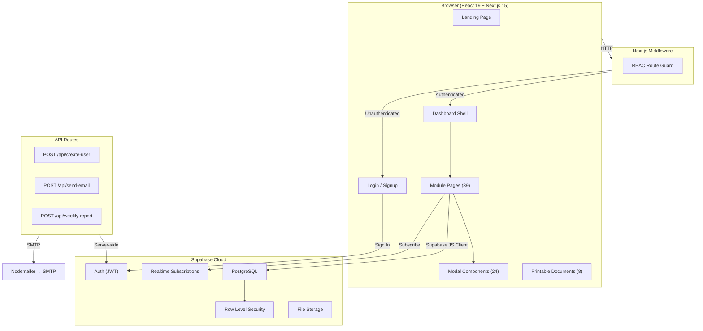
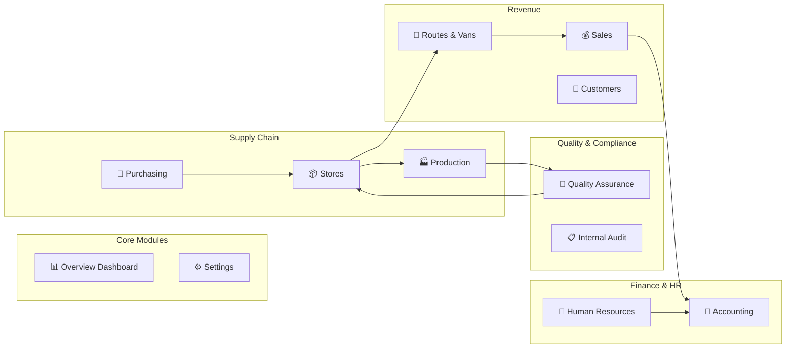
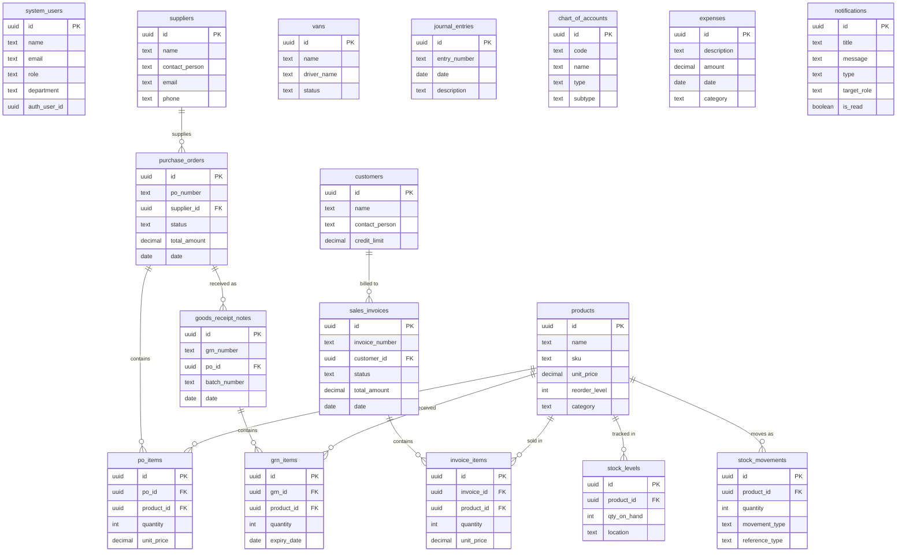
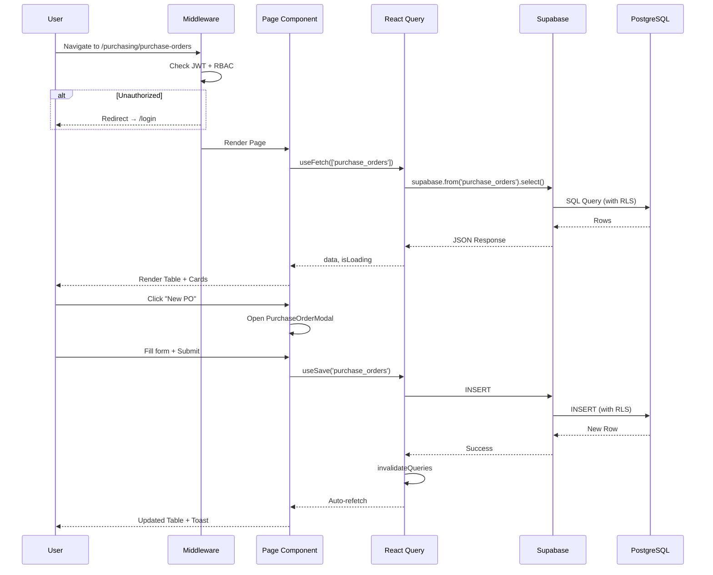
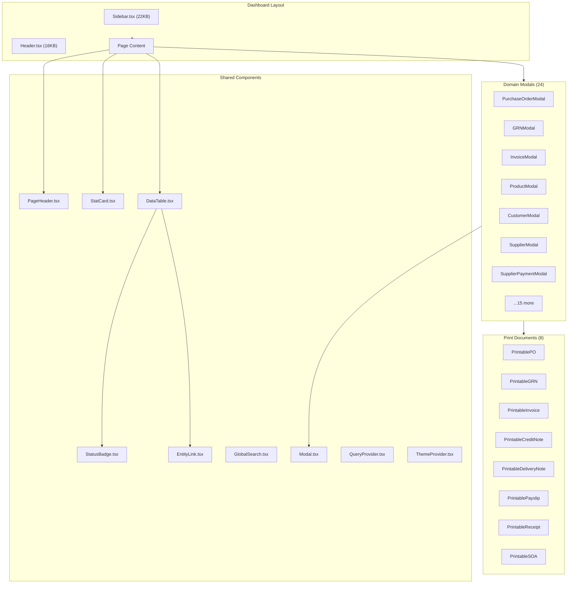
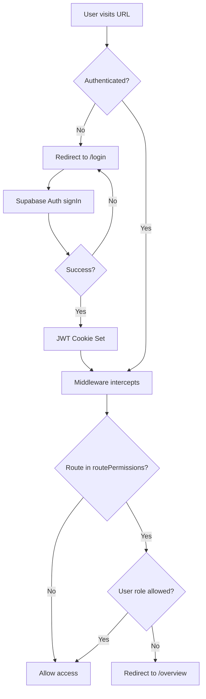
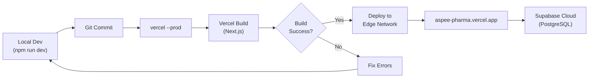
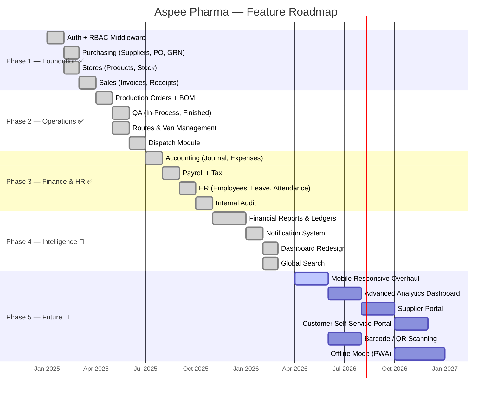

# Aspee Pharma ERP — System Architecture

> A full-featured pharmaceutical Enterprise Resource Planning system for Aspee Pharmaceuticals Ltd.

---

## 1. Tech Stack

| Layer | Technology | Version |
|---|---|---|
| **Framework** | Next.js (App Router) | 15.1.9 |
| **Language** | TypeScript | 5.x |
| **UI** | React | 19.0.0 |
| **Styling** | Vanilla CSS + CSS Variables | — |
| **Icons** | Lucide React | 0.577.0 |
| **Charts** | Recharts | 3.8.0 |
| **State** | TanStack React Query | 5.90.21 |
| **Forms** | React Hook Form + Zod | 7.x + 4.x |
| **Backend/DB** | Supabase (PostgreSQL + Auth + Realtime) | 2.99.0 |
| **Email** | Nodemailer | 8.x |
| **PDF** | jsPDF + html2canvas | 4.x + 1.x |
| **Hosting** | Vercel | — |

---

## 2. High-Level Architecture



---

## 3. Business Modules



### Module Details

| Module | Pages | Key Features |
|---|---|---|
| **Overview** | 1 | KPI cards, sales chart, revenue trend, low stock, expiry alerts, van status |
| **Purchasing** | 4 | Suppliers, Purchase Orders (approval workflow), GRN, Supplier Payments |
| **Stores** | 4 | Products, Stock Levels, Transfers, Material Requests |
| **Production** | 3 | Production Orders, BOM Management, Material Requests |
| **QA** | 3 | QA Dashboard, In-Process Controls, Finished Products Analysis |
| **Sales** | 4 | Invoices, Credit Notes, Receipts, Dispatch |
| **Customers** | 1 | Customer accounts, credit management, SOA |
| **Routes** | 1 | Van inventory, route management, daily loading |
| **Accounting** | 6 | Journal, Expenses, Payroll, Tax, Petty Cash, Financial Reports |
| **HR** | 4 | Employees, Attendance, Leave, Payroll Preparation |
| **Internal Audit** | 3 | Audit Plans, Reports, Non-Conformances |
| **Settings** | 4 | Profile, Users, Report Config, Audit Log |

---

## 4. Database Schema (ERD)



---

## 5. Data Flow



---

## 6. Component Architecture



### Library Utilities

| File | Purpose |
|---|---|
| [hooks.ts](file:///c:/Users/hp/Desktop/Developments/Aspee%20Pharmaceuticals/aspee-pharma/src/lib/hooks.ts) | [useFetch](file:///c:/Users/hp/Desktop/Developments/Aspee%20Pharmaceuticals/aspee-pharma/src/lib/hooks.ts#20-42), [useSave](file:///c:/Users/hp/Desktop/Developments/Aspee%20Pharmaceuticals/aspee-pharma/src/lib/hooks.ts#69-117), [useAction](file:///c:/Users/hp/Desktop/Developments/Aspee%20Pharmaceuticals/aspee-pharma/src/lib/hooks.ts#118-143), [useTableData](file:///c:/Users/hp/Desktop/Developments/Aspee%20Pharmaceuticals/aspee-pharma/src/lib/hooks.ts#144-217), [useCurrentUser](file:///c:/Users/hp/Desktop/Developments/Aspee%20Pharmaceuticals/aspee-pharma/src/lib/hooks.ts#344-373), [useNotifications](file:///c:/Users/hp/Desktop/Developments/Aspee%20Pharmaceuticals/aspee-pharma/src/lib/hooks.ts#374-466) |
| [supabase.ts](file:///c:/Users/hp/Desktop/Developments/Aspee%20Pharmaceuticals/aspee-pharma/src/lib/supabase.ts) | Supabase client initialization |
| [schemas.ts](file:///c:/Users/hp/Desktop/Developments/Aspee%20Pharmaceuticals/aspee-pharma/src/lib/schemas.ts) | Zod validation schemas |
| [auditLog.ts](file:///c:/Users/hp/Desktop/Developments/Aspee%20Pharmaceuticals/aspee-pharma/src/lib/auditLog.ts) | Action audit trail logging |
| [notifications.ts](file:///c:/Users/hp/Desktop/Developments/Aspee%20Pharmaceuticals/aspee-pharma/src/lib/notifications.ts) | Overdue invoice + expiry stock alerts |
| [csvExport.ts](file:///c:/Users/hp/Desktop/Developments/Aspee%20Pharmaceuticals/aspee-pharma/src/lib/csvExport.ts) | CSV file download utility |
| [pdfGenerator.ts](file:///c:/Users/hp/Desktop/Developments/Aspee%20Pharmaceuticals/aspee-pharma/src/lib/pdfGenerator.ts) | PDF generation wrapper |
| [formatCurrency.ts](file:///c:/Users/hp/Desktop/Developments/Aspee%20Pharmaceuticals/aspee-pharma/src/lib/formatCurrency.ts) | Currency formatting (GH₵) |
| [currency.ts](file:///c:/Users/hp/Desktop/Developments/Aspee%20Pharmaceuticals/aspee-pharma/src/lib/currency.ts) | Currency constants |

---

## 7. Authentication & Authorization



### Role-Based Access

| Role | Accessible Modules |
|---|---|
| **Super Admin** | Everything |
| **Sales Manager / Van Sales Rep** | Sales, Customers |
| **Purchasing Manager** | Purchasing, Suppliers |
| **Store Manager** | Stores, Production |
| **Production Manager** | Production, Stores |
| **Quality Assurance** | QA |
| **Accountant** | Accounting |
| **Internal Auditor** | Internal Audit |
| **HR Manager** | HR |
| **Managing Director** | Weekly Reports Review |

---

## 8. Deployment Pipeline



---

## 9. Key Design Patterns

| Pattern | Implementation |
|---|---|
| **Generic CRUD Hooks** | `useSave<T>`, `useCreate<T>`, `useUpdate<T>`, [useDelete](file:///c:/Users/hp/Desktop/Developments/Aspee%20Pharmaceuticals/aspee-pharma/src/lib/hooks.ts#287-317) — reusable for any table |
| **Modal-per-Entity** | Each entity has a dedicated modal (e.g., `InvoiceModal`, `GRNModal`) |
| **Printable Documents** | Separate `Printable*` components for A4 PDF generation |
| **Realtime Notifications** | Supabase Realtime channel subscriptions in [useNotifications](file:///c:/Users/hp/Desktop/Developments/Aspee%20Pharmaceuticals/aspee-pharma/src/lib/hooks.ts#374-466) |
| **CSS Variables** | Theme tokens (colors, spacing) in `:root` + `.dark` — instant dark mode |
| **Middleware RBAC** | Role check before page render via `routePermissions` map |
| **Staggered Animations** | `.animate-stagger > *` CSS with incremental delays |

---

## 10. Feature Roadmap



---

## 11. File Structure

```
aspee-pharma/
├── src/
│   ├── app/
│   │   ├── (dashboard)/          # Authenticated layout
│   │   │   ├── layout.tsx        # Sidebar + Header shell
│   │   │   ├── overview/         # Dashboard home
│   │   │   ├── purchasing/       # Suppliers, POs, GRN, Payments
│   │   │   ├── stores/           # Products, Stock, Transfers, Mat. Requests
│   │   │   ├── production/       # Orders, BOM, Material Requests
│   │   │   ├── qa/               # Dashboard, In-Process, Finished
│   │   │   ├── sales/            # Invoices, Credit Notes, Receipts, Dispatch
│   │   │   ├── customers/        # Customer management
│   │   │   ├── routes/           # Van & route management
│   │   │   ├── accounting/       # Journal, Expenses, Payroll, Tax, Petty Cash, Reports
│   │   │   ├── hr/               # Employees, Attendance, Leave, Payroll
│   │   │   ├── internal-audit/   # Plans, Reports, Non-Conformances
│   │   │   └── settings/         # Profile, Users, Reports, Audit Log
│   │   ├── api/                  # Server-side routes
│   │   │   ├── create-user/      # Admin user creation
│   │   │   ├── send-email/       # Transactional emails
│   │   │   └── weekly-report/    # Automated reports
│   │   ├── login/                # Auth page
│   │   ├── signup/               # Registration
│   │   ├── globals.css           # Design system tokens
│   │   └── page.tsx              # Landing page
│   ├── components/               # 44 shared components
│   │   ├── DataTable.tsx         # Generic sortable table
│   │   ├── Modal.tsx             # Base modal wrapper
│   │   ├── Sidebar.tsx           # Navigation sidebar
│   │   ├── Header.tsx            # Top bar with search/notifications
│   │   ├── (24 domain modals)    # Entity-specific CRUD modals
│   │   └── (8 printables)        # A4 document generators
│   ├── lib/                      # 9 utility modules
│   │   ├── hooks.ts              # React Query hooks
│   │   ├── supabase.ts           # Client setup
│   │   └── schemas.ts            # Zod schemas
│   └── middleware.ts             # Auth + RBAC guard
├── *.sql                         # 30 migration scripts
├── package.json
└── vercel.json
```

---

## 12. Environment Variables

| Variable | Purpose |
|---|---|
| `NEXT_PUBLIC_SUPABASE_URL` | Supabase project URL |
| `NEXT_PUBLIC_SUPABASE_ANON_KEY` | Supabase anonymous key (client) |
| `SUPABASE_SERVICE_ROLE_KEY` | Service role key (server API routes) |
| `SMTP_HOST`, `SMTP_PORT`, `SMTP_USER`, `SMTP_PASS` | Email configuration |

---

> **Last updated:** 20 March 2026
